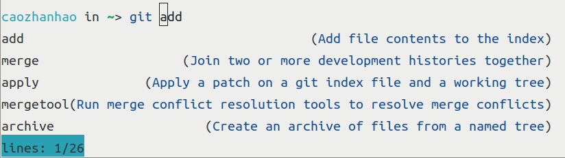
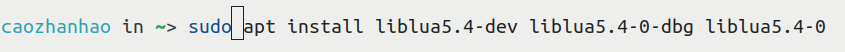

<h2 align="center">
Dish
</h2> 

<p align="center">
<strong>A Delightful Interactive Shell</strong>
</p>

<p align="center">
  <a href="CPP17" >
      
  </a>
  <a href="LICENSE" >
      
  </a>
</p>

Note: This project is still under development.If you encounter any bug,  
feel free to submit an Issue or PR.
### Feature
- Automatic completion and hint
- UTF8 support
- Extending with Lua
- Command line highlight

### Config.lua
- Dish will run `config.lua` for initialization, such as styles, alias, environments ...

#### Style
This is the color definitions for command line highlight.
```lua
dish.style = {
    cmd = dish.effects.fg_blue,
    arg = dish.effects.fg_cyan,
    string = dish.effects.fg_yellow,
    env = dish.effects.fg_green,
    error = dish.effects.fg_red,
    hint = dish.effects.faint,
    info = dish.effects.fg_magenta
}
  -- Dish Currently supports:
  -- bold = 1, faint, italic, underline, slow_blink, rapid_blink, color_reverse,
  -- fg_black = 30, fg_red, fg_green, fg_yellow, fg_blue, fg_magenta, fg_cyan, fg_white,
  -- bg_black = 40, bg_red, bg_green, bg_yellow, bg_blue, bg_magenta, bg_cyan, bg_white
```
#### Alias
```lua
dish.alias = {
    ls ="ls --color=tty",
    grep ="grep --color=auto --exclude-dir={.bzr,CVS,.git,.hg,.svn,.idea,.tox}"
}
```

### Extending With Lua
#### Custom Prompt
##### dish.prompt
- Returns a string
```lua
function prompt() 
    return ">> "
end
dish.prompt = my_prompt
```
#### Embedded Lua Function
One thing worth noting is that every argument passed to Lua is string.  

```lua
function hello(str)
    return string.format("hello, %s", str);    
end
dish.func["hello"] = hello;
```
```
$ hello dish
hello, dish
```

#### Completion/Hint
```lua
dish.complete = complete;
dish.enable_hint = true;
dish.hint = hint;
```
Two arguments will be passed to `dish.complete`/`dish.hint`
1. The string before the last word of the command line
2. The last word of the command line
- Return nil or not return for no completion/hint
- Use `dish.enable_hint = false` to disable hint.
##### dish.complete

- Return `table{ table {string1, string2}}}` or `table{ table {string1, string2, string3}}}`
- `string1` is the raw string to be put on the command line
- `string2` is the information you want to show when selecting completions
- `string3` is the string you want to show when selecting completions (default = `string1`)  
Selecting completions could be something like this:
```
$ git string1
add                (Add file contents to the index)
string3                                   (string2)
lines: 2/26
```
##### dish.hint

- Return a `string`  
Hint will be added after the pattern(the 2nd argument) on command line with a different color(defined int the config.lua)

#### Dish Interface
##### dish.environment
- Stores all environment variables in string
##### dish_get_tilde_path()
- Return the current path with `$HOME` replaced by `~`
##### dish_get_shrunk_path()  
Return the current path:   
- All the parent path will be replaced by its first character
- `$HOME` is replaced by `~`
##### dish_add_history(timestamp, cmd)
- Add a history  

### Note
Dish currently does not support scripting.

### Bundled
- [fmtlib](https://github.com/fmtlib/fmt)
- [sol](https://github.com/ThePhD/sol2)
- [tiny-utf8](https://github.com/DuffsDevice/tiny-utf8)
- [widechar_width.h(from fish-shell)](https://github.com/fish-shell/fish-shell/tree/master/src/widecharwidth)

### Reference
#### Lua
- [Lua document](https://www.lua.org/docs.html)
- [sol document](https://sol2.readthedocs.io)
- [{fmt} document](https://fmt.dev)
#### Shell
- [Implementing a Job Control Shell](https://www.gnu.org/software/libc/manual/html_node/Implementing-a-Shell.html)
- [build-your-own-shell](https://github.com/tokenrove/build-your-own-shell)
- [Writing Your Own Shell](https://www.cs.purdue.edu/homes/grr/SystemsProgrammingBook/Book/Chapter5-WritingYourOwnShell.pdf)
- [Tutorial - Write a Shell in C](https://brennan.io/2015/01/16/write-a-shell-in-c/)
- [fish-shell](https://github.com/fish-shell/fish-shell)

### Contact
- If you have any questions or suggestions, please submit an issue or email me.
- Email: cao2013zh at 163 dot com

### Contribution
- Any contributions are welcomed, just send a PR.

### License
- Dish is licensed under the [Apache-2.0 license](LICENSE)
